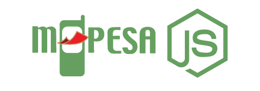

 # Getting Started

    this is a npm package for integrating mpesa savices with node js

### Installation 

        npm install mpesa-express

### Features

### Quick Start

        npm install mpesa-express  

Add to project

        const Mpesa = require ('mpesa-express');

        Initialize  with options
 
        const options = {

         // Cousumer Key and Consumer Secret are found on your Client Dashboard
         // https://developer.safaricom.co.ke/user/me/apps

         consumer_key: "<STRING>",
         consumer_secret: "<STRING>",

         // Passkey , Business Shortcode and Shortcode are found on the Test Credentials Page
         // https://developer.safaricom.co.ke/test_credentials

         passkey: "<STRING>",
         BusinessShortCode: "<INTEGER>", // 174379
         ShortCode: "<INTEGER>", //174379

         // Secruity Credentials is generated by adding the consumer secret as the Initiator Security Password and clicking Generate Credentials
         SecurityCredential: "<STRING>",
         Initiator: "<STRING>",
         callBackBaseUrl: "<STRING>",
       };
 
    
        const mpesa = new Mpesa(options)

###   Lipa Na M-Pesa Online Payment API
###### Use this API to initiate online payment on behalf of a customer.

        mpesa.sktPush(Amount, PhoneNumber, AccountReference, TransactionDesc) 

### Lipa Na M-Pesa Query Request API
###### Use this API to check the status of a Lipa Na M-Pesa Online Payment.

        mpesa.stkCheck(CheckoutRequestID)

### C2B Register URL
 ###### Use this API to register validation and confirmation URLs on M-Pesa 

        //The C2B options are found on the API Section under C2B Register URL 
        //https://developer.safaricom.co.ke/c2b/apis/post/registerurl

        // Confirmation URL is the CALLBACK URL to your app
        // Safaricom will send a POST request to this url once a C2B payment is confirmed
        const ConfirmationURL = "<STRING>" // https://youapp/confirm

        // Validation URL is the CALLBACK URL to your app
        // Safaricom will send a POST request to this url once a C2B payment is confirmed
        const ValidationURL = "<STRING>" // https://youapp/valid

        // Both ConfirmationURL and ValidationURL must be HTTPS

        // Response types are: Completed or Cancelled.
        const ResponseType = "<STRING>"

        // This is the Business C2B shortcode
        const ShortCode = "<INTEGER>" // 600000
        
        mpesa.c2bRegister( ConfirmationURL, ValidationURL, ResponseType, ShortCode)

### C2B Simulate Transaction
###### This API is used to make payment requests from Client to Business (C2B). 
###### You can use the sandbox provided test credentials down below to simulates a payment made from the client phone's STK/SIM Toolkit menu, and enables you to receive the payment requests in real time.

        mpesa.c2bTransact(ShortCode, CommandID, Amount, Msisdn, BillRefNumber)

### B2C Payment Request
###### Use this API to transact between an M-Pesa short code to a phone number registered on M-Pesa.

        mpesa.b2c(Amount, PartyA, PartyB, Remarks, CommandID, Occassion, SecurityCredential)

### Account Balance Request
###### Use this API to enquire the balance on an M-Pesa BuyGoods (Till Number)

        mpesa.checkAccountBalance(CommandID, IdentifierType, Remarks)
